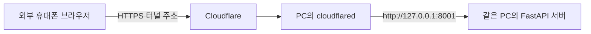

<!--
file_path: README.md

길동무 통합 추론과 휴대폰 테스트 앱의 설치·실행·결과 확인 방법을 안내한다.
-->

# gildongmu-app

보행가능영역, 장애물, 보행자 신호등을 같은 화면에서 분석하는 프로젝트입니다.

- Mask2Former: 보행가능영역·횡단보도 분할
- YOLO: 보행 장애물 검출
- YOLO + MobileNetV3-Small: 보행자 신호등 검출·색상 분류
- BoT-SORT: 객체 추적
- FastAPI: 휴대폰 카메라 실시간 테스트
- 서울 버스 API: GPS 기반 주변 정류장·방향 선택과 도착 음성 안내
- 버스 YOLO + PARSeq: 목표 노선 번호 인식

저장 영상 추론과 휴대폰 실시간 테스트를 지원합니다. 판단 좌표는 영상 기준이며 실제 거리나
사용자의 횡단 안전을 보장하지 않습니다.

## 1. 실행 준비

### 팀원용 설치 순서

Linux 또는 Windows의 WSL에서 Bash로 실행합니다. 아래 바이너리 설치 명령은 x86_64 PC 기준입니다.
Windows 사용자는 Python, 서버, `cloudflared`를 모두 같은 WSL 안에서 실행하세요.
통합 앱의 공통 Python 버전은 **3.12**입니다. 버스 모델을 개발했던 3.10 환경과 별도로
이 저장소에 `.venv`를 만들면 됩니다.

현재 검증한 환경은 다음과 같습니다. 가상환경과 Python 실행 파일은 각 PC에서 설치하며 Git에 포함하지 않습니다.

| 항목 | 검증한 버전·장치 |
| --- | --- |
| Python | 3.12.15 |
| PyTorch / torchvision | 2.14.0 / 0.29.0, CUDA 13.0 빌드 |
| Transformers / Ultralytics | 5.17.0 / 8.4.152 |
| 버스 OCR timm / PyTorch Lightning | 0.9.16 / 2.5.1 |
| GPU / NVIDIA 드라이버 | RTX 5080 Laptop GPU / 592.27 |

#### 1) 시스템 도구와 저장소 준비

Ubuntu 24.04/26.04 또는 해당 WSL 배포판에서는 최초 한 번 다음 도구를 설치합니다.
`build-essential`은 GPU 실행 중 필요한 C 컴파일러를, `libgl1`과 GLib는 OpenCV 실행 라이브러리를 제공합니다.

```bash
sudo apt update
sudo apt install -y git curl build-essential libgl1 libglib2.0-0t64
```

Ubuntu 22.04에서는 위 명령의 `libglib2.0-0t64`를 `libglib2.0-0`으로 바꿉니다.
[Ubuntu 24.04 GLib 패키지](https://packages.ubuntu.com/noble/libglib2.0-0t64),
[Ubuntu 22.04 GLib 패키지](https://packages.ubuntu.com/jammy/libglib2.0-0).
다른 Linux 배포판에서는 같은 도구와 라이브러리를 해당 패키지 관리자로 준비합니다.

```bash
git clone --branch dev https://github.com/ai-cv-prj/gildongmu-app.git
cd gildongmu-app
```

이미 저장소를 받았다면 해당 프로젝트 폴더에서 아래 단계를 진행합니다.

#### 2) Python 3.12 가상환경 만들기

Python 3.12가 없는 PC에서는 `uv`로 Python과 가상환경을 함께 준비할 수 있습니다.
`--seed`는 이후 `python -m pip`를 사용할 수 있도록 pip도 설치합니다.
[uv 설치 안내](https://docs.astral.sh/uv/getting-started/installation/),
[가상환경 생성 옵션](https://docs.astral.sh/uv/reference/cli/#uv-venv).

```bash
curl -LsSf https://astral.sh/uv/install.sh | sh
export PATH="$HOME/.local/bin:$PATH"
uv venv --python 3.12.15 --seed .venv
source .venv/bin/activate
python --version
```

마지막 명령에서 `Python 3.12.15`가 출력되면 준비된 상태입니다.
Python 3.12와 venv 지원이 이미 설치되어 있다면 다음 방법도 사용할 수 있습니다.

```bash
python3.12 -m venv .venv
source .venv/bin/activate
```

#### 3) PyTorch와 나머지 패키지 설치

GPU용 또는 CPU용 PyTorch 중 실행 환경에 맞는 명령 하나를 먼저 실행합니다.
NVIDIA GPU를 사용할 때는 `nvidia-smi`로 드라이버를 확인하고 CUDA 13.0 지원 드라이버를 준비하세요.
아래 GPU 명령은 위 검증 환경에서 사용한 명령입니다. 다른 GPU·드라이버의 지원 빌드는
[PyTorch 설치 안내](https://pytorch.org/get-started/locally/)에서 확인할 수 있습니다.

GPU용:

```bash
python -m pip install torch==2.14.0 torchvision==0.29.0 \
  --index-url https://download.pytorch.org/whl/cu130
```

CPU용:

```bash
python -m pip install torch==2.14.0 torchvision==0.29.0 \
  --index-url https://download.pytorch.org/whl/cpu
```

이후 통합 추론, 버스 OCR, 서버와 테스트 패키지를 설치합니다.
`requirements.txt`는 공통 패키지 버전을 지정하며, 앞서 설치한 CUDA·CPU용 PyTorch도 해당 버전으로 인정됩니다.

```bash
python -m pip install -r requirements.txt
python -m pip check
```

`No broken requirements found.`가 나오면 패키지 의존성 검사에 통과한 것입니다.
GPU를 사용할 때는 다음 명령의 마지막 값이 `True`인지 확인합니다. CPU 환경에서는 `False`가 정상입니다.

```bash
python -c "import sys, torch; print(sys.version.split()[0]); print(torch.__version__); print(torch.version.cuda); print(torch.cuda.is_available())"
```

패키지를 추가·변경했다면 같은 가상환경에서 `python -m pip install -r requirements.txt`를 다시 실행합니다.
새 터미널에서 직접 Python 명령을 쓸 때는 `source .venv/bin/activate`로 활성화하고,
작업을 끝낼 때는 `deactivate`로 나올 수 있습니다. 전체 Python 설치 과정에서 `sudo pip`는 사용하지 않습니다.

#### 4) 휴대폰 접속용 cloudflared 설치

`cloudflared`는 Python 패키지가 아니라 별도로 설치하는 실행 파일입니다.
이미 설치되어 있으면 `cloudflared --version`으로 확인하고 다음 단계로 넘어갑니다.
설치가 필요한 Linux/WSL x86_64 PC에서는 다음 명령을 실행합니다.

```bash
mkdir -p "$HOME/.local/bin"
curl -fL https://github.com/cloudflare/cloudflared/releases/latest/download/cloudflared-linux-amd64 \
  -o "$HOME/.local/bin/cloudflared"
chmod +x "$HOME/.local/bin/cloudflared"
export PATH="$HOME/.local/bin:$PATH"
cloudflared --version
```

새 터미널에서 `uv` 또는 `cloudflared`를 찾지 못하면 `export PATH="$HOME/.local/bin:$PATH"`를 다시 실행합니다.
프론트엔드 회귀 테스트도 실행하려면 Node.js 22를 별도로 설치합니다. 앱 실행에는 Node.js가 필요하지 않습니다.

### 가중치와 데이터 배치

`weights/`와 `data/`는 Git에서 제외되므로 별도로 준비해야 합니다.

```text
gildongmu-app/
├── weights/
│   ├── walking/
│   │   ├── mask2former/
│   │   │   ├── config.json
│   │   │   ├── preprocessor_config.json
│   │   │   └── model.safetensors
│   │   └── yolo/
│   │       └── yolo26n_pedestrian29_stop_v3.pt
│   └── traffic/
│       ├── best_YOLO_v2.pt
│       └── best_MobileNet.pt
└── data/
    ├── samples/
    │   ├── input/                  # 직접 준비
    │   │   └── sample1/
    │   │       └── input.mp4
    │   └── output/                 # 영상 추론 시 자동 생성
    └── sessions/                   # 휴대폰 세션 시작 시 자동 생성
```

| 파일 | 용도 |
| --- | --- |
| `weights/walking/mask2former/` | 3클래스 분할 모델과 전처리 설정 |
| `weights/walking/yolo/yolo26n_pedestrian29_stop_v3.pt` | 장애물 검출 모델 |
| `weights/traffic/best_YOLO_v2.pt` | 보행자 신호등·횡단보도 검출 모델 |
| `weights/traffic/best_MobileNet.pt` | 신호등 색상 분류 모델 |
| `data/samples/input/` | 추론할 MP4 입력 폴더 |

Mask2Former는 가중치 파일뿐 아니라 `config.json`과 `preprocessor_config.json`도 필요합니다.

## 2. 저장 영상 추론

### 샘플 폴더 실행

```bash
source .venv/bin/activate
python -m scripts.run_video_inference --sample-dir data/samples/input/sample1
```

지정한 폴더 바로 아래의 MP4만 파일명 순서대로 처리합니다. 하위 폴더는 탐색하지 않습니다.

### 영상 한 개 실행

```bash
python -m scripts.run_video_inference \
  --video-path data/samples/input/sample1/input.mp4
```

### 추론 모드

| 모드 | 실행 모델 |
| --- | --- |
| `all` | 보행 영역 + 장애물 + 신호등 |
| `both` | 보행 영역 + 장애물 |
| `sidewalk` | 보행 영역 |
| `obstacle` | 장애물 |
| `traffic` | 신호등 |

기본값은 `all`입니다.

```bash
python -m scripts.run_video_inference \
  --mode traffic \
  --video-path data/samples/input/sample1/input.mp4 \
  --output-path data/samples/output/sample1/result_traffic.mp4
```

주요 옵션은 다음 명령으로 확인할 수 있습니다.

```bash
python -m scripts.run_video_inference --help
```

## 3. 휴대폰 실시간 테스트

위 가상환경·패키지·`cloudflared` 설치를 마친 뒤, **PC의 같은 프로젝트 폴더에서** 두 터미널을 열어 실행합니다.
`run.sh`는 `.venv/bin/python`을 직접 사용하므로 실행할 때 가상환경을 따로 활성화할 필요는 없습니다.
테스트하는 동안 서버와 터널 터미널을 모두 켜 둡니다.

```bash
# 터미널 1: API 서버
./scripts/run.sh
```

```bash
# 터미널 2: 휴대폰용 HTTPS 터널
./scripts/tunnel.sh
```

두 번째 터미널에 표시되는 `https://...trycloudflare.com` 주소를 휴대폰 브라우저에서 엽니다.
PC와 휴대폰 모두 인터넷에 연결되어 있으면 휴대폰은 LTE/5G나 다른 Wi-Fi에서도 접속할 수 있습니다.
Cloudflare Quick Tunnel은 임시 HTTPS 주소를 만들어 로컬 서버에 연결합니다.
[Cloudflare 공식 안내](https://developers.cloudflare.com/tunnel/get-started/quick-tunnels/).

### PC 주소와 휴대폰 주소 구분

| 접속 위치 | 사용할 주소 |
| --- | --- |
| 서버를 실행한 PC의 브라우저 | `http://127.0.0.1:8001` 또는 `http://localhost:8001` |
| 외부 휴대폰의 브라우저 | `tunnel.sh`가 출력한 `https://...trycloudflare.com` |
| 같은 PC의 cloudflared가 연결할 내부 서버 | `http://127.0.0.1:8001` |

`localhost`와 `127.0.0.1`은 주소를 여는 기기 자신을 뜻합니다. **휴대폰에서 localhost를 열면 휴대폰 자신을
가리키므로 PC에 연결되지 않습니다.** 휴대폰에서는 반드시 출력된 HTTPS 터널 주소를 사용합니다.
카메라 접근에도 HTTPS 등 보안 컨텍스트가 필요합니다.
[브라우저 카메라 접근 조건](https://developer.mozilla.org/en-US/docs/Web/API/MediaDevices/getUserMedia).



서버의 `APP_HOST`는 기본값 `127.0.0.1`로 둡니다. 터널이 같은 PC의 로컬 서버로 연결하므로
외부 휴대폰 접속을 위해 `0.0.0.0`으로 바꿀 필요가 없습니다.
참고로 `gildongmu-test-app`도 같은 연결 방식을 사용하며 기본 내부 포트는 `8000`입니다.
이 프로젝트의 기본 포트는 `8001`이고, `run.sh`와 `tunnel.sh`가 같은 설정을 읽습니다.

코드나 추론 설정을 바꾸면 서버를 `Ctrl+C`로 종료하고 `./scripts/run.sh`를 다시 실행합니다.
주소·포트가 그대로라면 터널은 켜 둔 채 사용할 수 있습니다. 주소·포트를 변경했거나 터널을 종료했다면
`./scripts/tunnel.sh`도 다시 실행하고 새 HTTPS 주소를 휴대폰에서 엽니다. 화면도 한 번 새로고침합니다.

### 휴대폰 테스트 순서

1. 화면 맨 위의 **길동무 시작하기**를 누릅니다. 음성 속도(1x·1.5x·2x)와 글자 크기(크게·더 크게·최대)를 설정한 뒤 상단 **안내 시작**을 누릅니다. 음성 속도를 선택하면 예시 안내를 두 번 들려줍니다.
2. 카메라 권한을 허용하면 기존 보행·신호등·횡단보도 안내가 시작됩니다.
3. 정류장 근접 안내 또는 상단 **버스 번호 입력** 버튼으로 번호 입력을 엽니다. 버튼을 누르면 정류장 검출 여부와 관계없이 바로 입력할 수 있고, 안내 음성이 끝나기 전에도 버스 찾기를 시작할 수 있습니다.
   **버스 번호 입력**을 눌러 위쪽 숫자·문자 키패드에서 `143`, `N26`, `마포07`처럼 입력한 뒤 **버스 찾기**를 누릅니다. **음성 입력**으로 유효한 번호가 인식되면 바로 버스 찾기를 시작합니다.
   새 정류장에 도착할 때마다 입력란은 비워지며, 같은 도착에서 번호를 바꿀 때만 직전 입력을 보여 줍니다.
4. 같은 목표 노선으로 GPS 도착정보 조회와 카메라 번호 인식을 함께 시작합니다.
   **정류장·도착정보**를 펼치면 정류장·방향 후보와 위치 재조회 기능을 확인할 수 있습니다. 위치 권한 오류는 카메라 번호 인식을 중단시키지 않습니다.
5. 화면 아래 **테스트 설정 및 상태**의 **일시중지**는 카메라 전송·녹화·위치 조회·음성을 멈추며 **재개**하면 새 관측으로 이어집니다.
   화면을 숨겼다가 돌아왔을 때도 같은 방식으로 처리합니다. 일시중지 중에도 **이전 화면으로**를 누를 수 있으며,
   버스 탐색 중이면 안내를 재개한 뒤 노선 입력으로 돌아갑니다. 상단 **안내 종료**를 누르면 **계속 안내 / 안내 종료** 확인 화면이 나옵니다. 종료를 확정하면 촬영과 안내를 끝내고 기록을 저장한 뒤 오프닝 화면으로 돌아갑니다.

휴대폰 기종·메모·프레임 지표와 30초 영상 구간 기록은 화면 아래 **테스트 설정 및 상태**에서 확인합니다.
기종·메모는 안내 시작 시 저장되며, 안내 중이나 일시중지 중에도 어느 화면에서든 수정한 뒤 **기종·메모 저장**을 누르면 현재 테스트 기록에 반영됩니다.
저장 완료 안내를 확인한 뒤 테스트를 종료해 주세요. 수정한 내용은 `session.json`과 결과 허브에 반영되고, 저장 폴더 이름은 테스트 시작 시의 이름을 유지합니다.
보행 중 상단 **글자 크기 설정**으로 설정을 바꾼 뒤 **안내 시작**을 누르면 같은 세션으로 돌아갑니다.
음성 입력은 브라우저의 음성 인식 기능을 지원할 때 사용할 수 있으며, 미지원·권한 거부 시 직접 입력합니다.
글자 크기와 음성 속도는 이 브라우저에 저장됩니다.

오류가 발생하면 **오류 로그 저장** 버튼이 접힌 테스트 설정 밖에 표시됩니다.
서버로 전달한 오류도 기기 기록에 남아 복구 후 또는 새로고침 후 다운로드할 수 있습니다.
기록한 원본 영상과 추론 프레임은 구간 종료 시 기기 보관함에 저장하며, 서버의 원본·추론 영상이
`ready`로 확인된 뒤에만 기기 보관본을 삭제합니다. 업로드·변환 실패 또는 추론 프레임이 없는
원본 영상은 보존하고, **기기에 보관한 원본 영상 → 선택한 영상 저장**으로 다운로드할 수 있습니다.
기기 보관 용량이 부족하거나 브라우저가 저장을 차단하면 저장 실패를 표시하며 현재 페이지에서는
영상 다운로드를 제공합니다. 이 경우 새로고침 전에 직접 저장해야 합니다.

### 버스 기능 준비

도착정보 알림을 사용하려면 서버 `.env`에 `SEOUL_BUS_API_KEY`를 설정합니다. 현재 도착정보 구현은 서울시 버스 API를 사용합니다.
키는 브라우저로 보내지 않으며 `scripts/run.sh`가 환경변수로 읽습니다. 직접 uvicorn을 실행해도
프로젝트 루트의 `.env`에서 키를 읽습니다. 서버 프로세스에 이미 설정된 `SEOUL_BUS_API_KEY`가
있으면 그 값(빈 값 포함)이 우선합니다. `.env`에 키를 추가하거나 변경한 뒤에는 서버를 재시작합니다.

GPS 도착정보가 나오지 않으면 `GET /api/bus/status`의 `api_key_configured`를 먼저 확인합니다.
`false`이면 키가 서버에 반영되지 않은 상태이고, `true`는 키가 입력되었다는 뜻으로 실제 인증 성공을 보장하지는 않습니다.
화면의 안내로 인증 실패, API 연결 실패, 위치 권한 거절, GPS 오차를 구분할 수 있습니다.
현재 구현은 GPS 오차 30m 이하의 최신 위치를 사용하며, 해당 위치 30m 안에 입력 노선의 정류장이 있어야 합니다.

버스 번호 인식에는 `configs/bus.yaml`에서 지정한 다음 파일이 필요합니다.

```text
weights/bus/
├── route-display-b.pt
├── yolo11n.pt
├── parseq-bb5792a6.pt
└── parseq-src/                 # 고정 PARSeq 소스 전체, hubconf.py 포함
```

가중치와 PARSeq 소스는 별도로 공유받아 배치합니다. `weights/`는 Git에서 제외되므로
새 clone에는 별도로 준비해야 합니다. `requirements.txt`의
OCR 의존성도 설치합니다. 기존 환경은 `python -m pip install -r requirements.txt`로 갱신하세요.
`GET /api/bus/status`는 API 키와 모델 파일의 준비 여부만 반환하며 모델의 실제 로딩 성공을 뜻하지는 않습니다.

OCR은 목표 노선 확정 후 별도 작업 스레드에서 최신 프레임을 처리합니다. 이전 노선·세션의 결과는 폐기하고
보행 프레임 응답에는 OCR의 원래 촬영 시각을 함께 보냅니다. 모델 누락·OCR 오류는 별도 상태로 표시하며
기존 보행·신호 응답은 계속 제공합니다. API 키가 없어도 카메라 번호 인식은 사용할 수 있습니다.
번호를 입력하고 **버스 찾기**를 누르면 카메라에서 해당 번호를 찾습니다. 도착정보 API 미설정 시에는
위치·도착정보 조회만 중단하며, 번호 인식과 번호 확인 음성은 계속됩니다. 확인된 번호는 주 안내 카드에도
표시합니다. 정류장 도착 확인 후에는 장애물 탐지·표시·음성을 중단합니다. 모델 파일 누락·로딩 실패는 카메라 번호 인식
오류로 별도 표시합니다. `arrival_ready: false`와 `recognition_ready: true`는 함께 나올 수 있는 정상 상태입니다.

버스 탐색 중 화면과 저장 오버레이는 큰 번호 카드와 버스·번호 영역 박스를 표시합니다.
목표 번호 후보는 “7011번 버스 인식 중”, 반복 확인된 번호는
“7011번 버스 확인함”을 각각 두 번 연속 안내합니다. 화면에는 한 번 표시하며,
번호 인식만으로 정류장 도착을 확정하지 않습니다.
다른 노선도 같은 버스에서 온전한 번호를 3회 이상 반복 확인하면 “604번 버스, 다른 노선”처럼
짧게 두 번 안내합니다.
LED 일부 누락, 충돌, 오래된 결과는 음성 확정에 사용하지 않습니다.
서버 MP3가 지연되면 기기의 한국어 음성 합성을 시도합니다. 기기 합성은 실시간으로 들리지만
현재 녹화 오디오에는 들어가지 않으며, 서버 MP3는 실시간 재생과 녹화에 함께 사용합니다.

버스 번호 제출 후에는 지원되는 Android 기기에서 LED 촬영용 수동 노출을 시도합니다.
`configs/app.yaml`의 `camera.bus_led_exposure_enabled`로 켜고 끄며,
`bus_led_exposure_time_us`의 기본값은 약 1/60초인 `16667`입니다. 미지원 기기는 기본 촬영을 유지합니다.
번호 재입력·보행 복귀 때는 이전 설정을 복원하고, 안내를 종료하면 카메라를 종료합니다.
버스 OCR과 신호등·횡단보도·녹화가 카메라 하나를 공유하므로 버스 모드 중에는 모두 같은 노출값을 사용합니다.
실제 LED 번호 인식 개선 효과는 기기별 현장 검증이 필요합니다.
`events.jsonl`의 `camera_exposure` 이벤트는 지원 범위, 적용 전 설정, 요청값과 수동 노출 읽기 결과를
기록합니다. 적용 실패 시 복원 전 설정도 남기며, 촬영 중 설정이 달라지면 `changed`를 한 번 기록합니다.
`applied`는 브라우저 설정값 확인을 뜻하며 LED 줄무늬 개선을 보장하지 않습니다. 자동 노출 모드에서는
브라우저의 `exposureTime`이 유효한 측정값이 아니므로 `actual_us`는 `null`로 기록합니다.
영상만으로 수동 노출 적용 여부를 판단할 수 없으므로 비교할 때는 같은 세션의 `events.jsonl`도 확인합니다.

GPS의 도착정보와 OCR 번호 확인은 독립적입니다. API의 해당 정류장 도착 상태만 도착정보로 표시하고,
OCR 한 번 관측은 번호 후보로 안내하고, 목표 번호를 반복 확인하면 **143번 버스 확인함.**처럼
입력한 번호를 확인했다고 안내합니다. 번호 인식만으로 도착을 확정하지 않습니다. 이 음성은 GPS 도착정보와 별개로 동작합니다. GPS는 10초, OCR은 3초가 지난 관측으로 새 음성을 시작하지 않습니다.

버스 음성은 기존 보행 위험·횡단보도·신호 안내보다 낮은 우선순위로 재생합니다. 동적 버스 안내는 서버 MP3를
우선 사용하고 실패하면 브라우저 한국어 합성을 시도합니다. 브라우저 합성은 오버레이 녹화의 MP3 오디오 트랙에
포함되지 않습니다. 정류장 선택과 GPS/OCR 안내 이력은 세션의 `events.jsonl`에
`event_group: "bus"`로 기록합니다.

정류장 근접은 화면 기준의 임시 시험 기능입니다. 모델이 정류장(`transit_stop`)으로 감지한 박스가
화면 하단 또는 좌우 가장자리에서 충분히 크고 검출 신뢰도가 0.30 이상일 때, 최근 2초 안에
같은 정류장을 3회 이상, 최소 1.2초에 걸쳐 관측하면 **정류장 근접 추정**으로 확정합니다.
중간의 미검출·카메라 흔들림에는 후보를 최대 1초, 확정된 근접 상태를 최대 3초 유지합니다.
유지 중에는 **재확인 중**을 표시하며 지난 프레임의 정류장 박스를 현재 화면에 그리지 않습니다.
유지 시간이 지나면 현재 근접 여부는 다시 확인하지만, 세션의 근접 확인 기록은 남습니다.

결과는 `results.jsonl`의 `stop_proximity`에도 기록합니다. 첫 근접 확정 때만
`arrival_event: {type: "stop_arrival", event_id: 1, ...}`가 발생하고 이후에는 `null`입니다.
버스 번호 입력은 `(session_id, arrival_event_id)`를 기준으로 한 번만 시작합니다.
`arrival_recorded`는 세션에서 근접을 확인한 기록이며 현재도 근처에 있다는 뜻은 아닙니다.
새 테스트 세션에서 이 기록이 초기화됩니다. 근접 도착 확인 후에는
“정류장입니다. 버스를 선택하세요.”를 안내하며 **탑승할 버스 번호** 입력 화면을 엽니다.
도착 시 정지 음성은 재생하지 않고, 안내 음성의 완료와 관계없이 번호를 선택할 수 있습니다.
번호를 수정할 때는 도착 안내를 다시 재생하지 않습니다. 음성 입력을 시작하면 재생 중이거나
재생을 기다리는 도착 안내를 종료해 음성 입력이 끝난 뒤에도 다시 나오지 않게 합니다.
`7016`, `N26`, `마포07`처럼 숫자·한글·영문을 입력할 수 있고,
**이전 화면으로**로 질문을 종료할 수 있습니다. 취소·제출 후에는 같은 도착으로 자동 재질문하지
않으며 보행 화면의 **버스 번호 입력** 또는 버스 탐색 화면의 **이전 화면으로** 버튼으로 다시 열 수 있습니다. 횡단 중에는 도착 질문을 시작하지 않습니다.

자동 정류장 근접 확인 또는 **버스 번호 입력** 버튼 이후에는 장애물 모델 추론, 위험 박스·방향 표시,
장애물 음성을 모두 끕니다. 번호 입력·버스 탐색·재입력 중에도 꺼진 상태를 유지합니다.
입력을 취소하고 보행 화면으로 돌아가거나 새 테스트를 시작하면 장애물 기능을 다시 켭니다.
보행 복귀 시 이전 장애물 추적·경고 기억을 초기화합니다. 버스 OCR, 신호등·횡단보도 안내는 독립적으로 동작합니다.
근접 기준은 `configs/inference.yaml`의 `stop_proximity`에서 조정합니다.

보행 안내에는 유효한 예측 위험과 객체 없는 노면 경고도 연결합니다. 이동 후보는 위험·주의 객체와
근거리 보행 가능 노면으로 검증하고, 확인되지 않은 후보는 안내하지 않습니다. 잠깐 미검출된
장애물은 유지하며 좌우 방향 변경에 확인 시간을 둡니다. 긴급 멈춤은 즉시 적용합니다.
실시간과 녹화 영상 추론의 장애물 안내 행동은 정지와 좌우 회피뿐입니다.
측면에만 위험이 있거나 전 방향 위험 객체가 모두 사람인 기존 서행 상황은 안내 없음으로 처리하며,
위험도와 객체 표시는 유지합니다. 별도의 서행 행동·음성 이벤트·음원은 사용하지 않습니다.
관련 시간은 `configs/audio.yaml`의 `walking_lateral_confirm_ms`, `walking_from_stop_confirm_ms`,
`walking_repeat_none_ms`, `walking_stop_repeat_none_ms`, `walking_missing_hold_ms`에서 조정합니다.
좌우 회피의 한 걸음·두 걸음 문구와 정지 음원은 유지합니다.

화면을 켠 상태에서 사용해야 합니다. 영상 기록은 기본으로 꺼져 있으며, 필요한 때 30초 구간을
선택할 수 있습니다. 한 구간이 끝나면 같은 테스트에서 다음 구간을 다시 기록할 수 있습니다.
카메라 원본에는 마이크 소리와 안내 음성이 들어가지 않습니다. 추론 결과 영상도 서버에서
프레임별 판단을 시각화한 무음 영상입니다. 한국어 합성을 지원하지 않으면 입력 화면으로 안내합니다.
터널 주소는 실행할 때마다 달라지므로 외부에 공개하지 마세요.

서버 주소와 포트의 기본값은 `configs/app.yaml`에 있습니다. 로컬에서만 바꾸려면 `.env`에
`APP_HOST`, `APP_PORT`를 지정합니다. `.env` 값이 YAML보다 우선합니다. 필요한 경우
`cp .env.example .env`로 템플릿을 복사하고 값을 설정합니다.

## 4. 결과 확인

### 저장 영상 결과

기본 저장 위치는 입력 샘플 폴더 이름을 따른 경로입니다.

```text
data/samples/input/sample1/input.mp4
                         ↓
data/samples/output/sample1/result_input.mp4
data/samples/output/sample1/jsonl/result_input.risk.jsonl
```

같은 결과 이름이 있으면 `(1)`, `(2)`를 붙여 기존 결과를 보존합니다. 추론에 실패하면 완성되지
않은 결과는 공개하지 않고 기존 결과를 유지합니다.

### 휴대폰 세션 결과

```text
test-result/YYYYMMDD/<기종명_촬영시각_테스트메모>/
├── clips/
│   ├── clip_001/
│   │   ├── original.webm   # 선택 구간의 카메라와 실제 재생 안내 음성 (.mp4 가능)
│   │   ├── inference.mp4  # 화면 오버레이와 안내 음성이 포함된 추론 결과
│   │   └── manifest.json  # 저장 상태·촬영 구간·추론 프레임 시각/해시
│   └── clip_002/          # 이어서 기록한 다음 구간
├── results.jsonl          # 프레임별 추론 결과
├── events.jsonl           # 지연·음성·탑승·GPS/OCR·녹화 이벤트 통합
└── session.json           # 세션 정보
test-result/logs/app.log   # 요청 ID별 서버 수신·응답 전송·오류 로그 (자정마다 회전)
test-result/logs/client-events.jsonl # 세션 생성 전/종료 후도 포함한 브라우저 진단
test-result/logs/cloudflared-*.log   # tunnel.sh 실행별 연결 로그 (종료 후에도 보존)
```

날짜는 한국 시간 기준입니다. `test-result`는 프로젝트 안에 있으며 저장 위치는
`configs/paths.yaml`의 `session_dir`로 변경할 수 있습니다. 영상은 버튼으로 선택한 구간만
남기며 각 구간은 최대 30초입니다. 한 테스트에서 최대 5구간, 휴대폰의 업로드 대기 자료는
총 120MiB까지 보관합니다. 원본·추론 입력 업로드와 MP4 생성은 테스트 종료 후에 진행됩니다.
영상 생성 성공 후 입력 JPEG·마스크 PNG·프레임별 JSON과 청크 폴더를 자동 정리하여,
완료된 클립은 영상 2개와 `manifest.json`만 남깁니다. 추론 프레임이 없는 구간은 원본 영상과
상태 파일만 남습니다. 변환 실패 시에는 재시도에 필요한 입력을 유지합니다.
일반 추론 중에는 프레임별 이미지를 저장하지 않습니다. 세션 기록은 `session.json`,
`results.jsonl`, `events.jsonl`로 모으며, 이벤트가 없으면 이벤트 파일은 만들지 않습니다.
`events.jsonl`의 `event_group`은 `client_timing`, `boarding`, `bus`, `recording`, `client_diagnostic`을 구분합니다.
선택한 구간이 없으면 영상 파일도 없습니다. 영상 파일 이름이 같더라도 `clip_001`, `clip_002`처럼
별도 폴더여서 기존 구간을 덮어쓰지 않습니다. 영상이 필요한 테스트는 종료 뒤 저장 상태를
확인하고 페이지를 닫으세요. 녹화 중 휴대폰의 영상 인코딩 비용은 남으므로 실기기 지연을
`events.jsonl`의 `client_timing` 이벤트에서 `recording_active` 전후로 비교할 수 있습니다.
`manifest.json`의 `frames[].clip_offset_ms`는 원본 구간 시작 이후 각 추론 입력 프레임의 촬영 시각입니다.
원본은 연속 영상이고 추론 영상은 처리된 프레임만 담으므로 두 영상의 프레임 수는 다릅니다.
서버가 추론 영상을 변환하는 동안에는 새 테스트 시작이 잠시 제한됩니다.
`results.jsonl`의 `risk_diagnostics`에는 객체별 위험 등급, 판정 이유, 화면 하단 좌표,
근접 경로 진입 예상 시간과 TTC가 기록됩니다. `server_timing`에는 JPEG 디코딩·서버 처리 시간이
밀리초로 기록됩니다. `events.jsonl`의 `client_timing` 이벤트 중 `kind: "frame"` 행에는 캡처 호출부터 JPEG 인코딩 완료까지(`capture_ms`),
요청 왕복(`round_trip_ms`), 결과 처리(`result_ms`)가, `overlay` 행에는 실제 박스 그리기까지의
시간(`overlay_delay_ms`)이 기록됩니다. `audio` 행에는 음성 상태와 JPEG 인코딩 완료 후 실제 재생 시작까지의
시간(`audio_delay_ms`)과 보행 안내 행동(`action`)이 기록됩니다. 브라우저와 서버 시계의
절대 시각을 빼서 지연을 계산하지 않습니다.

### 통신 오류 진단과 복구

`Failed to fetch`가 발생하면 `logs/client-events.jsonl`에서 `request_error`를 찾아
`operation`, `path`, `stage`, `http_status`, `elapsed_ms`, `request_id`를 확인합니다.
`stage`는 요청 전송(`request`), 응답 본문 읽기(`response_body`), HTTP 오류(`http`),
제한 시간 초과(`timeout`), 사용자 취소(`abort`)를 구분합니다. 같은 `request_id`를
`app.log`의 `request_received`, `response_emitted`, `request_failed`와 대조하면 서버가
요청을 받았는지, 응답을 내보냈는지 확인할 수 있습니다. `response_emitted`와 HTTP 200은
휴대폰의 응답 수신 성공을 보장하지 않습니다. 브라우저가 공개하지 않는 DNS/TLS·통신망의
세부 실패 원인은 이 로그만으로 확정할 수 없으며, 터널 연결 기록과 함께 확인합니다.

진단에는 당시 화면, 온라인/화면 숨김 여부, 카메라·녹화 상태, 마지막 프레임 번호,
전송/완료 확인 대기 영상 번호가 포함됩니다. `clip_stop.reason`은 30초 제한, 프레임 전송
중단, 일시중지, 카메라 종료 등을 구분하고, `clip_upload_failed.upload_stage`는 종료 확인,
전송 전 조회, 실제 전송, 저장 결과 조회 중 실패한 단계를 구분합니다. `frame_reconnecting`,
`frame_recovered`, `frame_failure`, `session_stop`, `start_blocked`로 상태 전환을 추적합니다.
세션을 확인할 수 있는 진단은 해당 세션 `events.jsonl`에도 `client_diagnostic`으로 남습니다.

브라우저는 진단 메타데이터를 `localStorage`의 `gildongmu-client-events-v1`에 최대 100건
보관합니다. 전송되지 않은 최초 요청 실패와 최근 기록을 유지하며, 연결 복구·페이지 재진입·
15초 주기마다 20건씩 전송하고 서버의 접수 확인 후 삭제합니다. 저장소를 사용할 수 없는
브라우저에서는 메모리에만 보관합니다. 영상·요청 본문·GPS 쿼리·테스트 메모는 진단에
포함하지 않습니다. `occurred_at_ms`는 휴대폰 시각, `server_at`은 서버 접수 시각이며
`monotonic_clock_ms`와 `time_origin_ms`도 함께 남겨 시계 차이를 확인할 수 있습니다.

프레임·세션 종료·영상 상태 조회·영상 업로드는 일시적 통신 오류, HTTP 429/5xx에 자동
재시도합니다. 프레임은 같은 번호·촬영 시각·JPEG로 다시 보내며 서버는 가장 최근의 동일
요청에 저장된 응답을 돌려주므로 추론과 결과 기록을 중복 실행하지 않습니다. 계속 연결이
실패해도 번호 입력과 세션을 유지하며 재연결하고, 오래된 응답은 현재 안내에 표시하지
않습니다. 사용자 종료는 재연결 대기와 요청을 취소합니다. 녹화의 30초·프레임 공백 제한은
계속 적용됩니다. 새 세션 생성과 버스 번호 변경은 자동 재전송하지 않습니다.

## 5. 설정 파일

| 파일 | 역할 |
| --- | --- |
| `configs/paths.yaml` | 입력·결과·세션·가중치·화면·음원 경로 |
| `configs/inference.yaml` | 모델 실행·추적·위험 판단 설정 |
| `configs/app.yaml` | 서버·카메라·녹화·업로드·세션 설정 |
| `configs/audio.yaml` | 음성 합성·재생·안내 시간 설정 |
| `configs/bus.yaml` | 버스 OCR 모델 경로·처리 주기·GPS 도착 조회 설정 |

모든 상대 경로는 프로젝트 루트 기준입니다. 절대 경로도 사용할 수 있습니다. 설정을 변경한 뒤에는
서버를 다시 시작하고 휴대폰 화면을 새로고침하세요.

명령행 옵션은 YAML 설정보다 우선합니다.

## 6. 주요 폴더

| 경로 | 역할 |
| --- | --- |
| `backend/` | FastAPI, 세션 저장, 실시간 추론 연결 |
| `configs/` | 실행 설정 |
| `frontend/` | 휴대폰 화면, 카메라, 오버레이, 음성, 녹화 |
| `scripts/` | 서버·터널·영상 추론 실행 진입점 |
| `src/` | 모델 추론, 추적, 위험 판단, 시각화, 음성 합성 |
| `tests/` | Python·프론트엔드 회귀 테스트 |
| `docs/` | 설계와 실험 기록 |

## 7. 테스트

Python 테스트:

```bash
python -m pytest -q
```

프론트엔드 테스트:

```bash
node --test tests/frontend/test_*.js tests/frontend/test_*.cjs
```

자동 테스트는 코드 연결과 입출력 동작을 확인합니다. 실제 모델의 정확도와 GPU 처리 속도는 입력
영상과 가중치를 준비해 별도로 확인해야 합니다.

## 8. 문제 해결

| 문제 | 확인할 내용 |
| --- | --- |
| 샘플 폴더가 없음 | `data/samples/input/sample1/`을 만들고 MP4를 넣었는지 확인 |
| 샘플 MP4가 없음 | `--sample-dir`가 MP4가 직접 들어 있는 폴더인지 확인 |
| 모델 파일이 없음 | `configs/paths.yaml`의 경로와 실제 가중치 위치 확인 |
| Mask2Former 로딩 실패 | 설정·전처리 파일과 모든 가중치 조각이 있는지 확인 |
| CUDA를 사용할 수 없음 | NVIDIA 드라이버와 CUDA 지원 PyTorch 확인 또는 `--device cpu` 사용 |
| OpenCV의 libGL.so.1·libgthread 로딩 실패 또는 C 컴파일러 없음 | 1장의 시스템 도구·라이브러리 설치 단계 확인 |
| Python 3.12를 찾지 못함 | 1장의 uv 설치 절차로 `.venv`를 먼저 생성 |
| 모듈을 찾을 수 없음 | 프로젝트 루트에서 가상환경을 활성화했는지 확인 |
| 터널 연결 실패 | 서버 실행 여부와 `.env`·`configs/app.yaml`의 포트 확인 |
| 휴대폰에서 localhost에 접속할 수 없음 | `tunnel.sh`가 출력한 최신 HTTPS 주소로 접속 |
| 휴대폰에서 502 오류 | 서버가 실행 중인지, 터널과 서버의 포트가 같은지 확인 |
| "이미 진행 중인 테스트가 있습니다" 표시 | 다른 기기가 테스트 중인지 확인. 브라우저를 강제로 닫아 남은 세션은 신호가 끊기고 `configs/app.yaml`의 `session.stale_after_s`(기본 30초)가 지나면 다음 시작 때 자동 저장·정리됨 |

## 9. 상세 문서

| 문서 | 내용 |
| --- | --- |
| [신호등 이식 기록](docs/traffic-signal-port_260929.md) | 신호등 추적·대상 선택·검증 범위 |
| [위험 판단 MVP](docs/risk_mvp_260929.md) | 초기 위험 판단 기준과 실행 방법 |
| [ROI 및 위험 검토](docs/roi_and_risk_review_20260921.md) | ROI 성능 측정과 영상 검토 |
| [위험 판단 개선](docs/risk_revision_implementation_20260921.md) | ROI 확장과 위험 해제 기준 |
| [공통 ROI 설계](docs/risk_shared_profile_20260921.md) | 공통 진행 경로와 측면 위험 판단 |

## 10. 팀 결과 중앙 조회 (Docker)

각 팀원 서버에서 분석 앱과 코드 수정을 계속하면서, 사용자 PC의 Docker 조회 서버에
`test-result`의 영상·분석 결과·로그를 모아 같은 브라우저 주소로 확인할 수 있습니다.
조회 서버는 GPU나 모델 가중치 없이 실행되며, 각 서버의 동기화 프로그램이 변경 결과를 전송합니다.

```bash
# 조회용 PC에서 최초 1회
python -m scripts.init_hub_env
docker compose --env-file .env.hub -f compose.hub.yaml up -d --build
```

HTTPS 주소와 개별 업로드 토큰을 설정한 각 팀원 서버에서는 `python -m scripts.sync_results`를
별도 실행합니다. 인증 설정·WSL Docker 준비·영상 보관·재시도·코드 변경 절차는
[팀 결과 중앙 조회 서버 안내](docs/result_hub.md)를 따릅니다.
